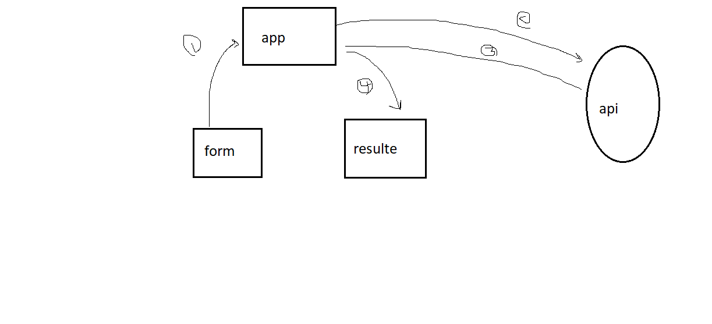

# api-server

## Class-26

### Resty

#### Links

[PR](https://github.com/YazanAlaiwah-401-advanced-javascript/resty/pull/0)
 

#### Modules

_`footer.js`_
_`header.js`_
_`form.js`_
_`resulte.js`_

#### Setup

git clone https://github.com/YazanAlaiwah-401-advanced-javascript/resty.git

#### Tests

Lint test: npm run lint

unit test: npm test

#### UML

